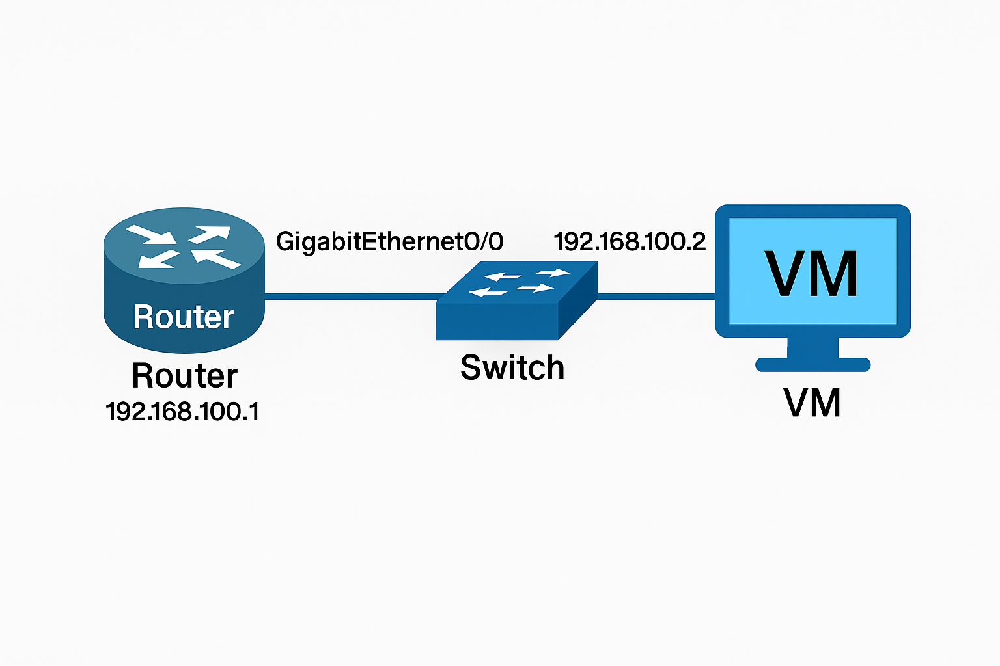

# Cisco Router Switch Network Simulation VLAN DHCP Inter VLAN Routing



Simulated Cisco Router &amp; Switch network with VLAN, DHCP, and inter-VLAN routing. Configured using Cisco 1841, Catalyst Switch, and Ubuntu VM to demonstrate subnet segmentation, trunking, and connectivity verification.

# Cisco Router & Switch Network Simulation  
*(VLAN, DHCP, and Inter-VLAN Routing on 192.168.100.0/24 Network)*  

---

##  Overview  
This repository demonstrates a **Router-on-a-Stick** configuration using a **Cisco 1841 Router**, **Catalyst Switch**, and an **Ubuntu Virtual Machine**.  
The goal was to simulate **Layer 2 and Layer 3 integration**, ensuring proper **VLAN segmentation, DHCP automation**, and **inter-VLAN communication** in a hybrid physical/virtual topology.  

The configuration and troubleshooting were performed using real Cisco IOS consoles and Ubuntu terminal sessions, mirroring enterprise lab conditions.  
**View the detailed topology and reasoning:**  
[View Network Topology Diagram →](topology_diagram.md)

---

##  Reasoning Outline  

1. **Objective Definition:**  
   Segment a single physical LAN into multiple subnets using VLANs, then restore communication through router subinterfaces.  

2. **Logical Design:**  
   - VLAN 10 → `192.168.100.0/24`  
   - Router subinterface `GigabitEthernet0/0.10` handles inter-VLAN routing.  
   - DHCP server configured on the router distributes addresses dynamically to Ubuntu VM clients.  

3. **Implementation Steps:**  
   - Create VLANs on the switch and assign access ports.  
   - Configure a trunk link between switch and router.  
   - Define subinterfaces on the router, each tagged with its respective VLAN ID.  
   - Enable IP routing and verify with `ping` and `show ip route`.  

4. **Verification:**  
   - `show ip interface brief` confirms VLAN subinterfaces are “up/up”.  
   - `show running-config` validates DHCP pools.  
   - Ubuntu VM successfully obtains IP via DHCP and communicates across VLANs.  

---

##  Key Commands Snapshot  

```bash
# On Router
enable
configure terminal
interface GigabitEthernet0/0.10
 encapsulation dot1Q 10
 ip address 192.168.100.1 255.255.255.0
 ip dhcp pool VLAN10
  network 192.168.100.0 255.255.255.0
  default-router 192.168.100.1
exit

# On Switch
vlan 10
 name STAFF
interface FastEthernet0/1
 switchport mode trunk
interface FastEthernet0/2
 switchport access vlan 10

Author
Izhar Haq
Senior Electrical & Software Engineer
