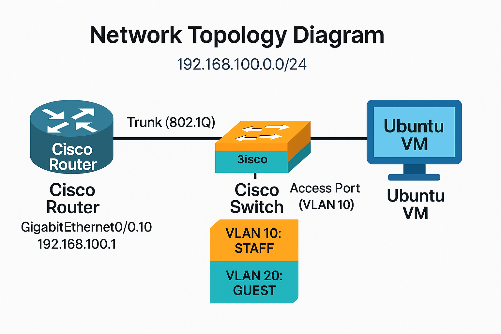

# 🗺️ Network Topology Diagram  
*(Cisco Router + Catalyst Switch + Ubuntu VM on 192.168.100.0/24 Network)*  

---

## ⚙️ Reasoning Outline  

This topology illustrates a **Router-on-a-Stick (RoaS)** implementation where a single physical interface on the **Cisco 1841 Router** handles multiple VLANs through subinterfaces.  
The purpose was to **segment broadcast domains** for performance and management while maintaining **Layer 3 connectivity** between them.

### Core Components  

| Device | Function | Interface | IP Address | Notes |
|:--------|:----------|:-----------|:-------------|:------|
| **Cisco Router (1841)** | Gateway for inter-VLAN routing | `GigabitEthernet0/0` | `192.168.100.1` | Trunk to Switch |
| **Catalyst Switch** | VLAN segmentation and trunking | `FastEthernet0/1–2` | – | VLAN 10 & 20 defined |
| **Ubuntu VM** | End host for testing | `ens33` | DHCP (192.168.100.x) | Receives IP dynamically |

The link between router and switch operates in **802.1Q trunk mode**, tagging packets for each VLAN.  
The switch’s access ports are mapped to specific VLANs, while the router’s subinterfaces handle Layer 3 routing per VLAN.  

---
## 🧩 Diagram Description

| **Device**       | **Interface**         | **IP Address**     | **Role / Function**              | **Connection**          |
|------------------:|----------------------:|-------------------:|---------------------------------:|------------------------:|
| **Cisco Router**  | GigabitEthernet0/0.10 | 192.168.100.1      | Inter-VLAN Routing & DHCP Server | Trunk (802.1Q) to Switch |
| **Cisco Switch**  | FastEthernet0/1–2     | –                  | VLAN Segmentation (STAFF & GUEST) | Access Ports to VLANs    |
| **Ubuntu VM**     | ens33                 | DHCP Assigned (192.168.100.x) | End Device / DHCP Client | VLAN 10 Access Port     |

**Author:**  
**Izhar Haq**  
Senior Electrical & Software Engineer
